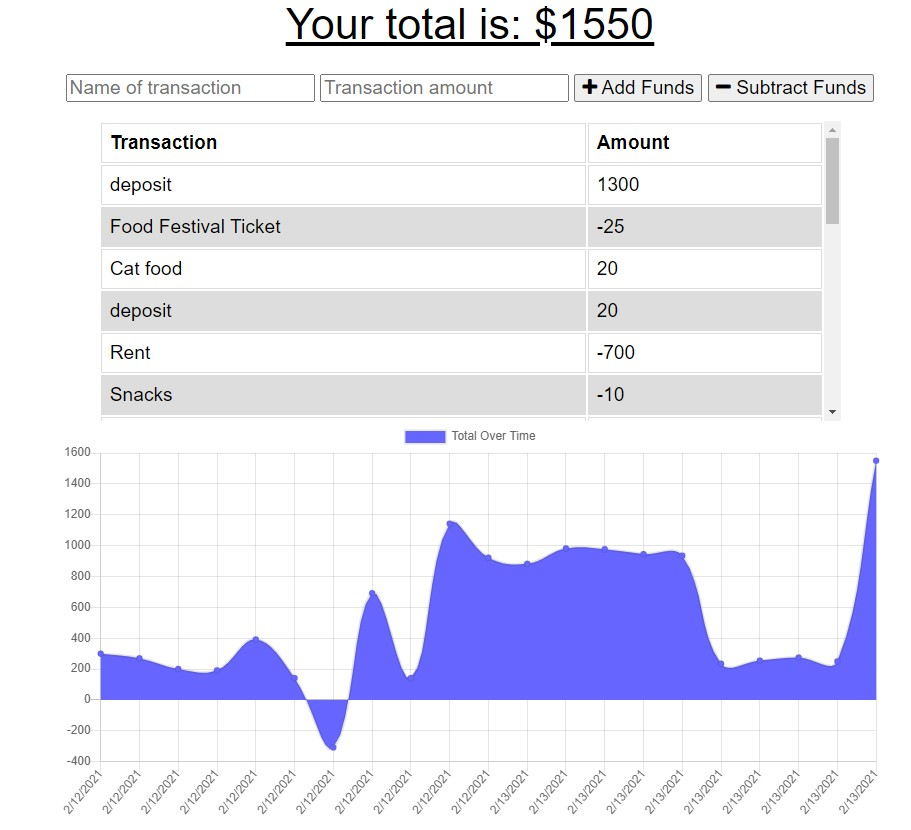

# The Budget Tracker

## Table of Contents
  1. [Description](#description)
  2. [Built With](#built-with)
  3. [Website and Github](#website-and-github)
  4. [Tests](#tests)
  5. [Questions](#questions)
  
## Description
The Budget Tracker is an application to log expenses and deposits with or without a data connection so that the balance remains accurate while traveling. Data submitted while offline is saved to an Indexed DB file until an internet connection can be reestablished.  At such point the data is send to the MongoDB and the user sees an alert that the data has been sent.

This project uses three technologies to help data persist offline: idb.js (to create an Indexed DB to hold pending transactions), Service Worker (to cache assets for viewing while offline) and a manifest.json (to provide information in JSON format for this progressive web application to be downloaded to a device like a native app).

## Built With
- Node.js
- JavaScript
- HTML
- CSS3
- Express
- Mongoose
- Morgan
- Compression
   
## Website and Github

[Heroku Deployment](https://secure-wave-10455.herokuapp.com/)

[Github Pages](https://github.com/webprinc3ss/budget-tracker)
 
## Tests
Test functioning and persistence in Chrome Dev Tools:
    - Watch for "Service Worker registered successfully." in the console.
    - Emulate and offline state under the Network tab and refreshing the page to check the page load
    - Entering a transaction while offline. Switch to online to see the alert message: "All saved transactions have been submitted!"
    - Check IndexedDB and Cache Storage files for saved data during tests.

## Questions
Please feel free to contact me, webprinc3ss at Github: https://github.com/webprinc3ss 

or

djabranton@gmail.com. 
      